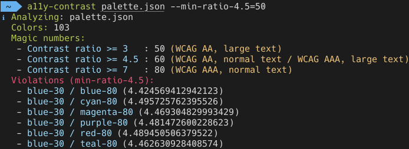

# A11y Contrast

 [](https://travis-ci.com/darekkay/a11y-contrast) [](https://github.com/darekkay/a11y-contrast/blob/master/LICENSE)

A CLI utility to calculate/verify accessible [magic numbers](https://designsystem.digital.gov/design-tokens/color/overview/#magic-number) for a color palette.



## Installation

This tool requires Node.js version 12+.

Install globally:

```bash
$ yarn add -g a11y-contrast     # Yarn
$ npm install -g a11y-contrast  # Npm
```

Or install as a local dependency:

```bash
$ yarn add a11y-contrast            # Yarn
$ npm install --save a11y-contrast  # Npm
```

Or use without installing:

```bash
$ npx a11y-contrast <file>
```

## Usage

View program help:

```
$ a11y-contrast --help
Usage: a11y-contrast <file> [options]

Arguments:
  <file>  Color palette file                              [required] [file]

Options:
  --min-ratio-3    Verify magic number for ratio 3                 [number]
  --min-ratio-4.5  Verify magic number for ratio 4.5               [number]
  --min-ratio-7    Verify magic number for ratio 7                 [number]
  -h, --help       Show help                     [commands: help] [boolean]
  -v, --version    Show version number        [commands: version] [boolean]
```

Run a full report for a color palette file:

```bash
$ a11y-contrast <file>
```

Verify that the color palette fulfills certain magic numbers per contrast ratio:

```bash
$ a11y-contrast <file> --min-ratio-3=40 --min-ratio-4.5=50 --min-ratio-7=70
```

## Color palette format

This tool handles flat or nested JSON files with color grades between 0 and 100.

- Flat JSON:

```json
{
  "blue-10": "#d9e8f6",
  "blue-20": "#aacdec",
  "blue-30": "#73b3e7",
  "green-10": "#dfeacd",
  "green-20": "#b8d293",
  "green-30": "#9bb672"
}
```

- Nested JSON:

```json
{
  "blue": {
    "blue-10": "#d9e8f6",
    "blue-20": "#aacdec",
    "blue-30": "#73b3e7"
  },
  "green": {
    "green-10": "#dfeacd",
    "green-20": "#b8d293",
    "green-30": "#9bb672"
  }
}
```

Check out some example color palettes under `/examples`.

## License

This project and its contents are open source under the [MIT license](LICENSE).
